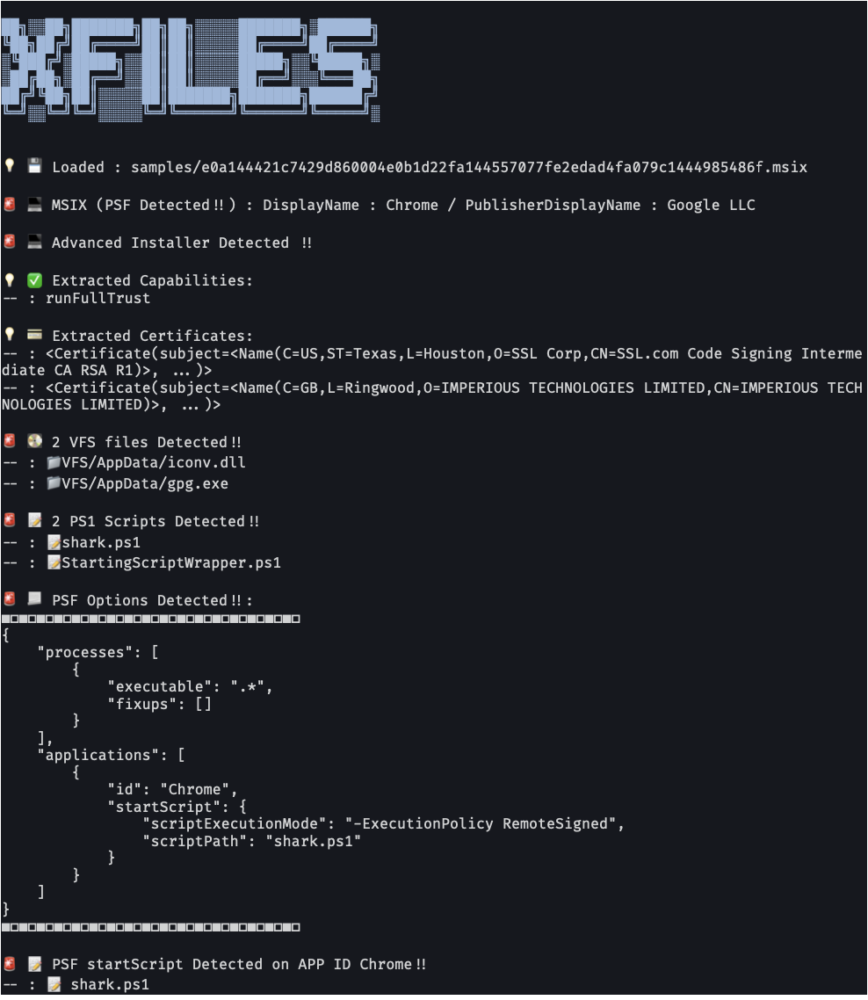

# Xfiles
* Repository of `XFiles`
* [JSAC2024](https://jsac.jpcert.or.jp/archive/2024/pdf/JSAC2024_2_1_nomura_yoshikawa_motoda_jp.pdf)

## Example



## Install
`pip install .`

## Usage
```
xfiles [file_path] --extract-certs --extract-ps1s --silent
```
* `file_path` : path to MSIX/APPX
* `--extract-certs` : extract certificate
* `--extract-ps1s` : extract PS1 sxripts
* `--silent` : silent mode